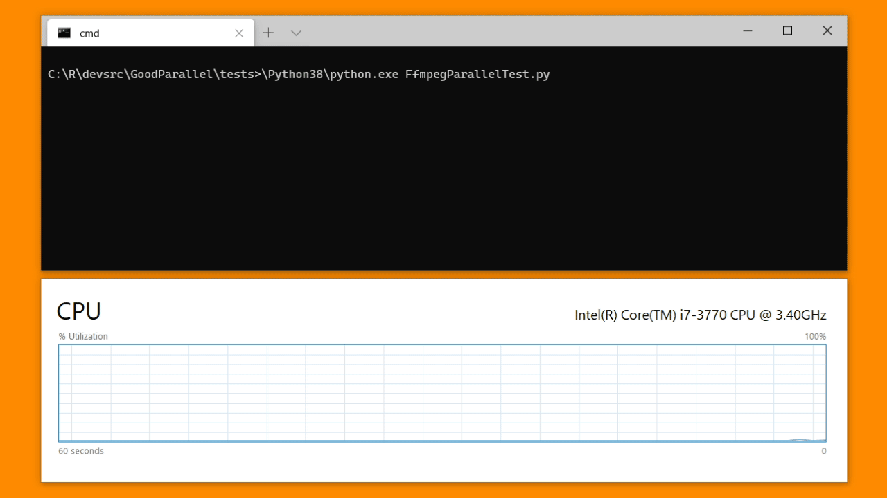

# GoodParallel: A Simple Native-Executable Process Pool

A super easy way to run native command lines in parallel,
without needing to wrap them in Python first.

All you have to do is provide the list of command strings you want
executed, and it will keep as many cores busy as it can. 



The more work you throw at it, the better.

## Example: Converting Image Files

For example, using GraphicsMagick to convert a bunch of image files directly:

```
gm convert -size 1280x! input/image-1.png -resize 1280x! -sharpen 1.0 +profile "*" -quality 100 output/image-1-1280.png
gm convert -size 1280x! input/image-2.png -resize 1280x! -sharpen 1.0 +profile "*" -quality 100 output/image-2-1280.png
gm convert -size 1280x! input/image-3.png -resize 1280x! -sharpen 1.0 +profile "*" -quality 100 output/image-3-1280.png
gm convert -size 1280x! input/image-4.png -resize 1280x! -sharpen 1.0 +profile "*" -quality 100 output/image-4-1280.png
gm convert -size 1280x! input/image-5.png -resize 1280x! -sharpen 1.0 +profile "*" -quality 100 output/image-5-1280.png
gm convert -size 1280x! input/image-6.png -resize 1280x! -sharpen 1.0 +profile "*" -quality 100 output/image-6-1280.png
gm convert -size 1280x! input/image-7.png -resize 1280x! -sharpen 1.0 +profile "*" -quality 100 output/image-7-1280.png
gm convert -size 1280x! input/image-8.png -resize 1280x! -sharpen 1.0 +profile "*" -quality 100 output/image-8-1280.png
```

is as easy as:

```python
commands = [ 'gm convert -size 1280x! input/image-{0}.png -resize 1280x! -sharpen 1.0 +profile "*" -quality 100 output/image-{0}-1280.png'.format(i) for i in range(1, 9) ]
simple_process_pool(commands)
```

This allows you to avoid using kludgy, incomplete, and undocumented
C++ library wrappers.

## What else is good about GoodParallel?

[multiprocessing.Pool](https://docs.python.org/3/library/multiprocessing.html#module-multiprocessing.pool) adds overhead when running non-Python programs:

```
$ ps auxf
USER       PID %CPU %MEM    VSZ   RSS TTY      STAT START   TIME COMMAND
root         1  0.0  0.0   8892   312 ?        Ssl  00:32   0:00 /init
root         5  0.0  0.0   8900   220 tty1     Ss   00:32   0:00 /init
max          6  0.0  0.0  17588  4324 tty1     S    00:32   0:00  \_ -bash
max        205  0.3  0.1 250900 10452 tty1     Tl   01:16   0:00      \_ python3 BadParallel.py
max        206  0.0  0.0  29704  4200 tty1     T    01:16   0:00      |   \_ python3 BadParallel.py
max        215  0.0  0.0  13956   820 tty1     T    01:16   0:00      |   |   \_ sleep 1000
max        207  0.0  0.0  29704  4180 tty1     T    01:16   0:00      |   \_ python3 BadParallel.py
max        214  0.0  0.0  13956   820 tty1     T    01:16   0:00      |   |   \_ sleep 1000
max        208  0.0  0.0  29704  4176 tty1     T    01:16   0:00      |   \_ python3 BadParallel.py
max        216  0.0  0.0  13956   820 tty1     T    01:16   0:00      |   |   \_ sleep 1000
max        209  0.0  0.0  29704  4176 tty1     T    01:16   0:00      |   \_ python3 BadParallel.py
max        218  0.0  0.0  13956   816 tty1     T    01:16   0:00      |   |   \_ sleep 1000
max        222  0.0  0.0  17384  1892 tty1     R    01:17   0:00      \_ ps auxf
```

[GoodParallel.simple_process_pool()](https://github.com/nuket/GoodParallel/blob/64f2d4cb9a00d510ff740a6cba16312d5feb9f31/GoodParallel/GoodParallel.py#L45) saves on memory at runtime:

```
$ ps auxf
USER       PID %CPU %MEM    VSZ   RSS TTY      STAT START   TIME COMMAND
root         1  0.0  0.0   8892   312 ?        Ssl  00:32   0:00 /init
root         5  0.0  0.0   8900   220 tty1     Ss   00:32   0:00 /init
max          6  0.0  0.0  17588  4332 tty1     S    00:32   0:00  \_ -bash
max        223  1.6  0.1  25648  8408 tty1     T    01:19   0:00      \_ python3 GoodParallel.py
max        224  0.0  0.0  13956   816 tty1     T    01:19   0:00      |   \_ sleep 1000
max        225  0.2  0.0  13956   820 tty1     T    01:19   0:00      |   \_ sleep 1000
max        226  0.2  0.0  13956   816 tty1     T    01:19   0:00      |   \_ sleep 1000
max        227  0.0  0.0  13956   816 tty1     T    01:19   0:00      |   \_ sleep 1000
max        228  0.0  0.0  17384  1892 tty1     R    01:19   0:00      \_ ps auxf
```

## What might be bad about GoodParallel?

It routes `stdout` and `stderr` straight to `/dev/null` to prevent processes from
blocking or not exiting, at the moment.

If you notice that some of the output files from the various commands are missing:

- Check to see what command was executed to create the output file and try running
  it manually.

- Make sure that if you dependencies in the commands to be run, that you split the 
  commands in multiple lists. i.e. if command A generates output B, and command C
  uses B as input, then make sure to run command A in one list `[A]`, and command C 
  in another list `[C]`.

## Compatibility

It works with Python 2.6 and up.
It works in color on Windows 10 Command Prompt, Windows Terminal, and Bash.

## License

```
GoodParallel
Copyright (c) 2020 Max Vilimpoc

Permission is hereby granted, free of charge, to any person obtaining a copy
of this software and associated documentation files (the "Software"), to deal
in the Software without restriction, including without limitation the rights
to use, copy, modify, merge, publish, distribute, sublicense, and/or sell
copies of the Software, and to permit persons to whom the Software is
furnished to do so, subject to the following conditions:

The above copyright notice and this permission notice shall be included in
all copies or substantial portions of the Software.

THE SOFTWARE IS PROVIDED "AS IS", WITHOUT WARRANTY OF ANY KIND, EXPRESS OR
IMPLIED, INCLUDING BUT NOT LIMITED TO THE WARRANTIES OF MERCHANTABILITY,
FITNESS FOR A PARTICULAR PURPOSE AND NONINFRINGEMENT. IN NO EVENT SHALL THE
AUTHORS OR COPYRIGHT HOLDERS BE LIABLE FOR ANY CLAIM, DAMAGES OR OTHER
LIABILITY, WHETHER IN AN ACTION OF CONTRACT, TORT OR OTHERWISE, ARISING FROM,
OUT OF OR IN CONNECTION WITH THE SOFTWARE OR THE USE OR OTHER DEALINGS IN
THE SOFTWARE.
```

## GitHub Repository

Latest versions of this code are stored at http://github.com/nuket/GoodParallel.
